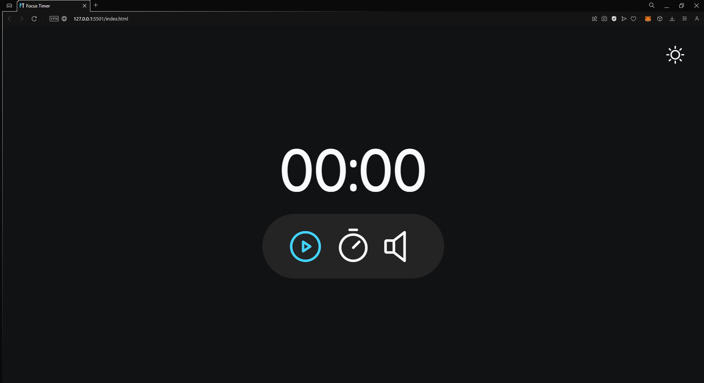
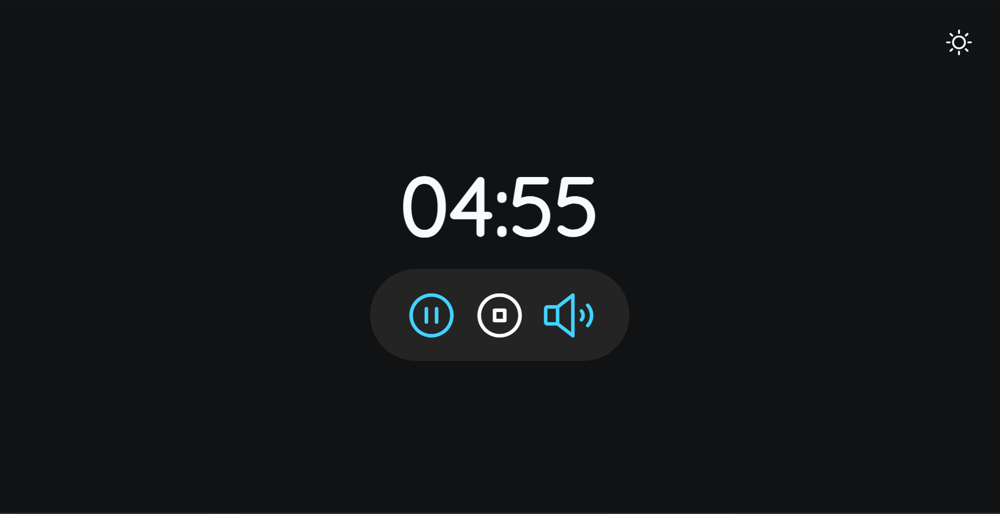
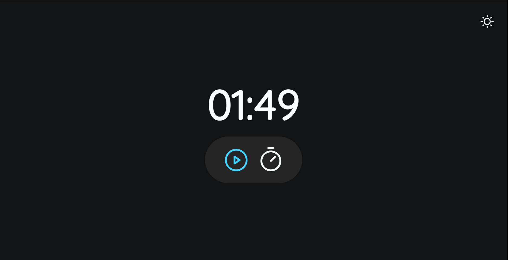

<h1 align="center">Focus timer</h1>

This project is a timer with calm song to study, based on Pomodoro's techinic.   

  <a href="#-tecnologias">Techs/Tecnologias</a>&nbsp;&nbsp;&nbsp;|&nbsp;&nbsp;&nbsp;
  <a href="#-projeto">Project/Projeto</a>&nbsp;&nbsp;&nbsp;|&nbsp;&nbsp;&nbsp;
  <a href="#-layout">Layout</a>&nbsp;&nbsp;&nbsp;|&nbsp;&nbsp;&nbsp;
  <a href="#memo-licença">License/Licença</a>

  

  

  

  

## 🚀 Techs / Tecnologias

Esse projeto foi desenvolvido com as seguintes tecnologias:

- HTML e CSS
- JavaScript
- Git e Github

## 💻 Project / Projeto

Um projecto que visa o conceito de tempo para estudos baseado na tecnica do Pomodoro, também possui um light mode. Você consegue controlar o tempo, pausar e dar play, ele emite sinais sonoros quando o tempo chega ao fim e também enquanto roda você pode decidir se gostaria de ouvir música ou não.

A project that aims at the concept of time for studies based on Pomodoro's technic, also has a light mode. You can control the time, pause and play, it emits sound signals when the time comes to an end and also while it runs you can decide whether you would like to listen to music or not.

## 🔖 Layout

Você pode visualizar o layout do projeto através do repositório. 
